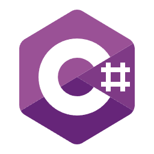
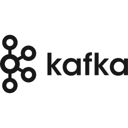
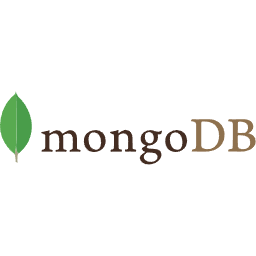

  
   
  <h1 align="center"><u>CQRS Plus</u></h1>

  

    Welcome to CQRSPlus!
     
    <a href="https://github.com/OxyProgrammer/cqrs-plus/issues">Report Issue</a>
    ·
    <a href="https://github.com/OxyProgrammer/cqrs-plus/issues">Request Feature</a>
  

  

<!-- ABOUT THE PROJECT -->

## About The Project

This repository contains a comprehensive CQRS implementation for a distributed environment. The code demonstrates a polyglot microservices application that implements Command Query Responsibility Segregation using Event Sourcing.
CQRS Plus uses a variety of technologies.

(<a href="#top">back to top</a>)

## Tech Stack

 

  
  
  
  

(<a href="#top">back to top</a>)

## CQRS With event Sourcing

  

#### CQRS
- **What is CQRS?**
  - CQRS separates read (queries) and write (commands) operations, enabling independent scaling and optimization.
  - It recognizes that reading and writing data have different requirements and can benefit from separate implementations.

#### Event Sourcing

- **Understanding Event Sourcing**
  - Event Sourcing captures state changes as a sequence of events over time.
  - Instead of directly modifying state, events representing changes are appended to an event log or store.

#### Combining CQRS with Event Sourcing

- **Why Combine CQRS with Event Sourcing?**
  - CQRS and Event Sourcing are often used together for scalable, maintainable systems.
  - Commands generate events, which are stored in an event log, facilitating a complete history of state changes.

#### Benefits

- **Advantages of CQRS Event Sourcing**
  - Clear separation of read and write operations leads to simpler codebases.
  - Event-driven architectures are enabled, promoting scalability and responsiveness.
  - Auditing and debugging are facilitated through the event log's historical data.

#### Considerations and Challenges

- **Things to Consider**
  - Careful planning is needed for data consistency, eventual consistency, and concurrency.
  - Additional complexity compared to CRUD-based architectures may arise, especially in managing event streams and ensuring consistency.

(<a href="#top">back to top</a>)

## Setup

You will need docker desktop on your machine to be able to run this repo.

Instructions to to published soon.

## Contributing

Contributions are welcome! If you'd like to contribute to this project, please follow these steps:

- Fork the repository.
- Create a new branch for your feature or bug fix.
- Make your changes.
- Test your changes thoroughly.
- Commit your changes with descriptive commit messages.
- Push your changes to your fork.
- Submit a pull request to the main repository's main branch.
- License
- This project is licensed under the MIT License.

(<a href="#top">back to top</a>)

## Acknowledgements

- [ASP.NET Core](https://learn.microsoft.com/en-us/aspnet/core/web-api/?view=aspnetcore-8.0)
- [Docker Desktop](https://www.docker.com/products/docker-desktop//)
- [Swagger](https://learn.microsoft.com/en-us/aspnet/core/tutorials/web-api-help-pages-using-swagger?view=aspnetcore-8.0)

(<a href="#top">back to top</a>)

## Contact

If you have any questions, suggestions, or issues, please feel free to contact the project maintainer:

OxyProgrammer - oxyprogrammer@gmail.com

Project Link: [https://github.com/OxyProgrammer/aspnet-plus](https://github.com/OxyProgrammer/aspnet-plus)

(<a href="#top">back to top</a>)
