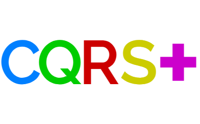
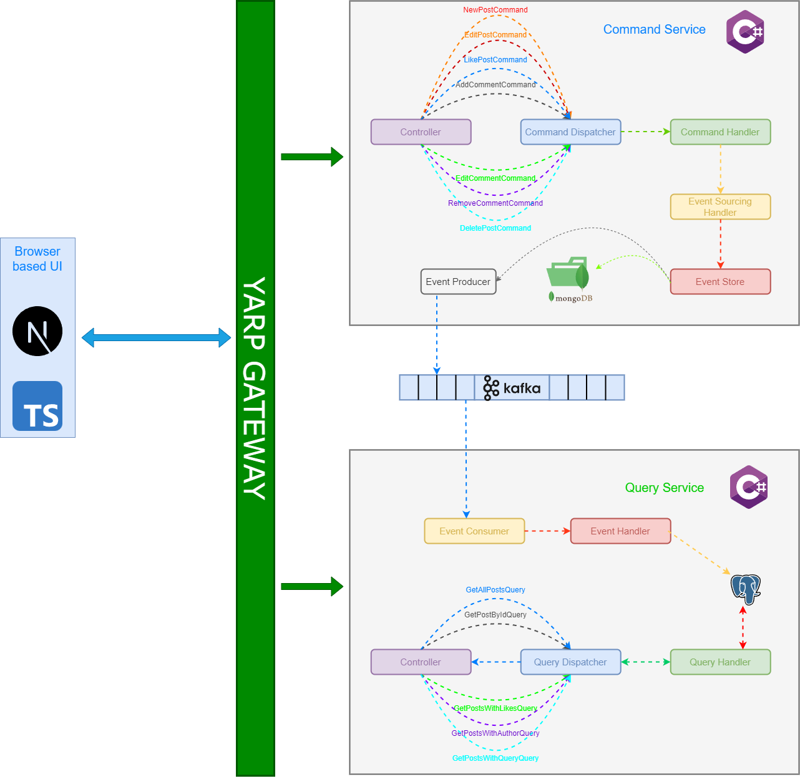
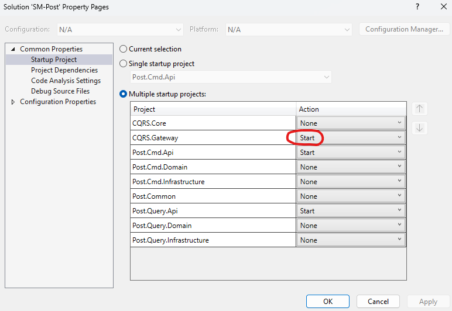
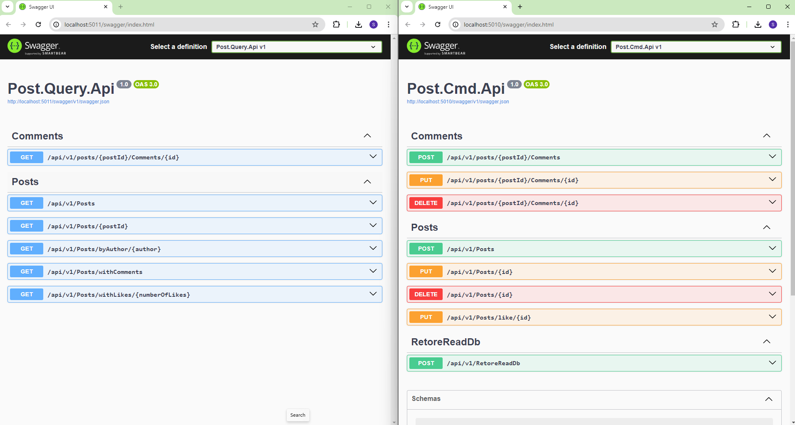

<div id="top"></div>

<div align="center">
  <a href="https://github.com/OxyProgrammer/cqrs-plus">
    
  </a>
  <br/>
  <h1 align="center"><u>CQRS Plus</u></h1>

  <p align="center">
    Welcome to CQRSPlus!
    <br/>
    <a href="https://github.com/OxyProgrammer/cqrs-plus/issues">Report Issue</a>
    ·
    <a href="https://github.com/OxyProgrammer/cqrs-plus/issues">Request Feature</a>
  </p>
  </div>

[](https://github.com/OxyProgrammer/cqrs-plus/issues)
[](https://github.com/OxyProgrammer/cqrs-plus/network)
[](https://github.com/OxyProgrammer/cqrs-plus/stargazers)
[](https://github.com/OxyProgrammer/cqrs-plus)

<!-- ABOUT THE PROJECT -->

## About The Project

This repository contains a comprehensive CQRS implementation for a distributed environment. The code demonstrates a microservices application that implements Command Query Responsibility Segregation using Event Sourcing.

<p align="right">(<a href="#top">back to top</a>)</p>

## Tech Stack

<br/>
<p align="center">
  
</p>
<p align="right">(<a href="#top">back to top</a>)</p>

## CQRS With event Sourcing

<p align="center">
  
</p>

#### CQRS
- **What is CQRS?**
  - CQRS separates read (queries) and write (commands) operations, enabling independent scaling and optimization.
  - It recognizes that reading and writing data have different requirements and can benefit from separate implementations.

#### Event Sourcing

- **Understanding Event Sourcing**
  - Event Sourcing captures state changes as a sequence of events over time.
  - Instead of directly modifying state, events representing changes are appended to an event log or store.

#### Combining CQRS with Event Sourcing

- **Why Combine CQRS with Event Sourcing?**
  - CQRS and Event Sourcing are often used together for scalable, maintainable systems.
  - Commands generate events, which are stored in an event log, facilitating a complete history of state changes.

#### Benefits

- **Advantages of CQRS Event Sourcing**
  - Clear separation of read and write operations leads to simpler codebases.
  - Event-driven architectures are enabled, promoting scalability and responsiveness.
  - Auditing and debugging are facilitated through the event log's historical data.

#### Considerations and Challenges

- **Things to Consider**
  - Careful planning is needed for data consistency, eventual consistency, and concurrency.
  - Additional complexity compared to CRUD-based architectures may arise, especially in managing event streams and ensuring consistency.

<p align="right">(<a href="#top">back to top</a>)</p>


## Setup

You will need docker desktop on your machine to be able to run this repo. There are two ways in which you could run the repo:

#### Using Visual Sudio Debugger

- Clone the repository to your local machine:

  ```
  git clone https://github.com/OxyProgrammer/cqrs-plus.git
  ```
- Navigate to the project directory:

  ```
  cd cqrs-plus
  ```
- You will need Kafka, MongoDb and PostgreSql instances running for the two services to work. Fire the following docker-compose command to start the containers:
  ```
  docker-compose -f docker-compose.debug.yaml up -d
  ```

- Open the solution file in visual studio and configure the two api projects as start up project:
  <p align="center">
    
  </p>

- Run the solution and you should be able to see the swagger pages opening up! 
  <p align="center">
    
  </p>

- The docker containers running should be shut down with following command:

  ```
  docker-compose -f docker-compose.debug.yaml down
  ```

#### Using Docker desktop only

- Clone the repository to your local machine:

  ```
  git clone https://github.com/OxyProgrammer/cqrs-plus.git
  ```

- Navigate to the project directory:

  ```
  cd cqrs-plus
  ```

- Build the images of the projects:
  ```
  docker-compose build
  ```

- Run the docker compose:
  ```
  docker-compose up -d
  ```

- Use the postman collection located [here](https://github.com/OxyProgrammer/cqrs-plus/blob/main/PostmanCollection/CQRSPlus.postman_collection.json) to run requests. Alternatively, you can access the swagger page to test the services:
  - Command Service: [http://localhost:5000/swagger/index.html](http://localhost:5000/swagger/index.html)
  - LookUp Service: [http://localhost:5001/swagger/index.html](http://localhost:5001/swagger/index.html)


## Contributing

Contributions are welcome! If you'd like to contribute to this project, please follow these steps:

- Fork the repository.
- Create a new branch for your feature or bug fix.
- Make your changes.
- Test your changes thoroughly.
- Commit your changes with descriptive commit messages.
- Push your changes to your fork.
- Submit a pull request to the main repository's main branch.
- License
- This project is licensed under the MIT License.

<p align="right">(<a href="#top">back to top</a>)</p>

## Acknowledgements

- [ASP.NET Core](https://learn.microsoft.com/en-us/aspnet/core/web-api/?view=aspnetcore-8.0)
- [Docker Desktop](https://www.docker.com/products/docker-desktop//)
- [Swagger](https://learn.microsoft.com/en-us/aspnet/core/tutorials/web-api-help-pages-using-swagger?view=aspnetcore-8.0)

<p align="right">(<a href="#top">back to top</a>)</p>

## Contact

If you have any questions, suggestions, or issues, please feel free to contact the project maintainer:

OxyProgrammer - oxyprogrammer@gmail.com

Project Link: [https://github.com/OxyProgrammer/cqrs-plus](https://github.com/OxyProgrammer/cqrs-plus)

<p align="right">(<a href="#top">back to top</a>)</p>